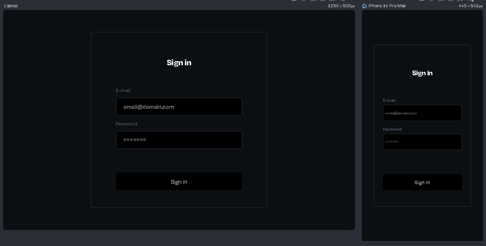

# Login with Rate Limiting (JavaScript && Php)




# System Overview

When the submit button is clicked, email and password format validation is performed using JavaScript. The data is then sent to server.php via an XMLHttpRequest object. On the server side, server.php checks if the client's IP address is on the blacklist. It also performs a request verification by querying the request table to check if the client’s IP has made more than 10 requests within the last 5 minutes.

## Database theory

```
DATABASE: loginratelimiting

TABLE CLIENT:
    Id (Primary Key);
    Email (Varchar 100);
    Password (Varchar 255);
    RegisterDate (DateTime current_timestamp);

TABLE REQUEST
    Id (Primary Key);
    Ip (Varchar 20);
    RequestDate (Timestamp);

TABLE BLACKLIST
    Id (Primary Key);
    Ip (Varchar 20, Unique);
    UnbanDate (Timestamp);
```